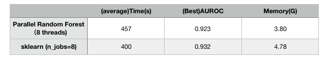

# Random Forest (c++)

## Introduction
An implementation of Random Forests, which is written in C++. The speed and perfomance is similar
 to sklearn-version.

## build
I just uses the standard library without any third-class library.

```
cd build
cmake ../
make -j4
```

## Load Data

The format of train data file is like `data/debug.txt` which is a sparse matrix. The format of test 
data is like `data/debug_test.txt`.

## Train

Parameters:

     * @param(int) nEstimators The number of trees in the forest. Default: 10
     * @param(string) criterion The function to measure the quality of a split.
     * Supported criteria are “gini” for the Gini impurity and “entropy” for
     * the information gain. Default: gini
     * @param(string) maxFeatures
     *          * If “auto”, then max_features=sqrt(n_features).
     *          * If “sqrt”, then max_features=sqrt(n_features) (same as “auto”).
     *          * If “log2”, then max_features=log2(n_features).
     *          * If "None", then max_features=n_features.
     * Default: "log2"
     * @param(int) maxDepth The maximum depth of the tree. -1 means any depth. Default: -1
     * @param(int) minSamplesSplit The minimum number of samples required to split
     * an internal node. Default:2
     * @param(int) minSamplesLeaf The minimum number of samples required to be at
     * a leaf node. Default:1
     * @param(int) nJobs The number of jobs to run in parallel for both fit and
     * predict. Default:1

```c++
RandomForest randomForest(100, "gini", "log2", -1, 150, 1, 1000000, 8);
randomForest.fit(trainData);
```

## Test

```
auto results = randomForest.predictProba(testData);
writeDataToCSV(results, testData, "../results/trainResults.csv", false);
```

## Performance

For a dataset which has about ~1.7 million samples, the performance of my implementation is similar
 to sklearn-version.


